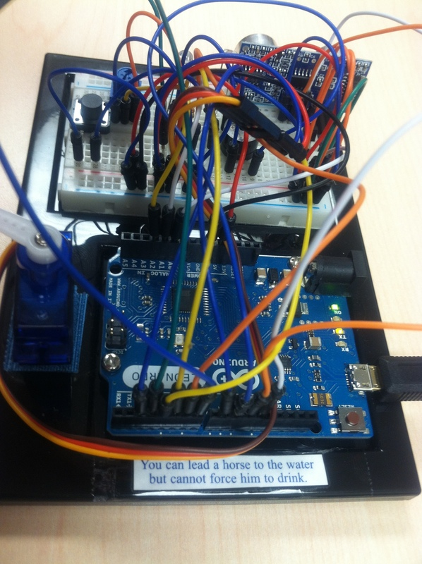

# Arduino-STEM-Presentation
An in-depth half-day public presentation and workshop I presented to a bunch of teachers in Dayton, Ohio in 2014 while working in the MAVLab (**Micro Air Vehicles Indoor Flight Laboratory**) for the Air Force Research Laboratory (AFRL). The goal was to help teachers learn about, get excited about, and be able to better teach STEM (Science, Technology, Engineering, and Math) to their students. Here is the main Arduino demo board I made:

->  <-

-> test text <-

And a quote I attached to it to remind us all of the importance of taking our own initiative in regards to our own learning:

> _You can lead a horse to the water but cannot force him to drink._

The main demo device I made for the presentation was basically just an Arduino Leonardo with a ton of sensors and things plugged into it, with a button to tell it to continue and to make basic selections in its crude "menus" where it was asking for user interaction. It acted as a USB HID keyboard device, typing out its responses right into a Microsoft Word doc I had ([see this section here](#interactive-demo-output)), interacting with the user via the button and sensors on the board and the text it typed back out into Microsoft Word in lieu of having a display attached to it to present data to the user. I thought it was more impressive and "interesting" that it could type out live text into your computer, for instance, as that was super impressive to me! The demo explained and output data from an ultrasonic sensor and a variety of other sensors in my feeble attempt to motivate the teachers and get them excited about what this little device could do! 

The demo had 2 parts to it, with 2 separate firmware files. It could not all fit in a single program since I entirely filled up the Flash memory on the Leonardo board due to all of the text output I stored inside it that I had it type out to the user. So, I split up the latter part of the demo into a separate firmware file I just loaded once done with part 1 of the live demo. Here is the full text output the Arduino Leonardo printed out for both demos, so you can see what kind of interaction we had with the main demo device. It really was cool--you should try it out for yourself!

## Interactive demo output:

1. Demo 1:
    1. Firmware for Demo 1:  
    1. PDF of the output it typed out to us: Arduino/Sketches/Gabriels_Main_Demo/Hello_Gabriel--Demo1_sample.pdf
    1. Word doc of the output it typed out to us:
1. Demo 2: 
    1. Firmware for Demo 1:  
    1. PDF of the output it typed out to us: 
    1. Word doc of the output it typed out to us:

I really enjoyed giving this presentation, and I highly recommend you check out and watch this video here to check out some of my truly exciting research I got to do while working there! 

1. My own work: [Flight_Controller--Arduino_interface_to_RC_Tx--Gabriel_Staples_large.mp4](Arduino/Engineering_Videos_and_Presentations/Flight_Controller--Arduino_interface_to_RC_Tx--Gabriel_Staples_large.mp4)
    1. 
    1. 
    1. Watch it on YouTube: [2/3 - Autonomous quadcopter guidance and control (*PID-based* pure pursuit demonstration)](https://www.youtube.com/watch?v=wY3oh2GIfCI)
    1. Other YouTube Videos:
        1. [1/3 - Autonomous quadcopter guidance and control (*physics-based* pure pursuit simulation)](https://www.youtube.com/watch?v=LjuPA43HceQ)
        1. [3/3 - Autonomous quadcopter guidance & control (*physics-based* pure pursuit demonstration)](https://www.youtube.com/watch?v=H5kXzpPFdII)
1. A peer's work (Dr. Mark Mears): [FlightLabProgressShort-Dr_Mark_Mears_large.mp4](Arduino/Engineering_Videos_and_Presentations/FlightLabProgressShort-Dr_Mark_Mears_large.mp4)
    1. This is incredibly-awesome work he did! Watch him autonomously perch a fixed-wing aircraft on a platform in this video, with the vehicle landing at near-zero forward and vertical velocity via a sharp pull-up and stall "parachute" type maneuver.
    1. 
1. [SUAS & Arduino Presentation - Staples - 20140403.pdf](Arduino/Engineering_Videos_and_Presentations/SUAS_and_Arduino_Presentation--Staples--20140403.pdf) - a publicly-released "Lunch and Learn" presentation I gave on my SUAS (Small Unmanned Aerial Systems) and Arduino work on autonomous systems in the indoor flight lab.

----

Note: this repo's content was formerly named and distributed as a single zip file named "Arduino STEM DVD - 20140623.zip".  

_Added to GitHub on 14 June 2020 to make distribution easier, since I still think the information is valuable and pertinent to teachers, students, engineers, and researchers today, and I'd like to make it easier to share what I've put together here._

